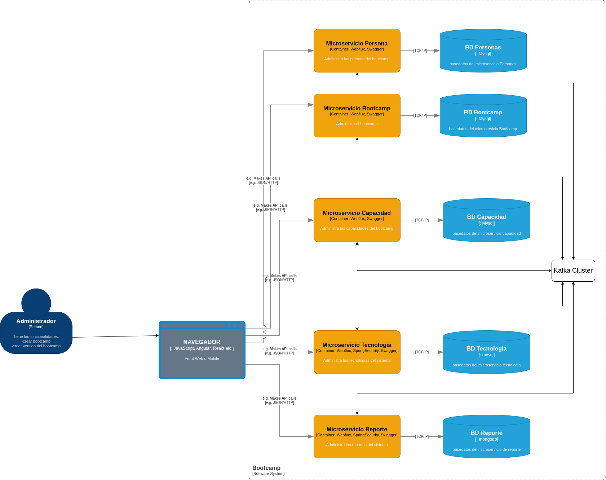

# on-class-project

Proyecto enfocado en bootcamps para el desarrollo de microservicios.

## Arquitectura

La siguiente imagen representa la arquitectura general del proyecto:



## Microservicios

- [people-ms](https://github.com/BrayanGuerreroXD/people-ms/tree/dev)
- [bootcamp-ms](https://github.com/BrayanGuerreroXD/bootcamp-ms/tree/dev)
- [capacity-ms](https://github.com/BrayanGuerreroXD/capacity-ms/tree/dev)
- [report-ms](https://github.com/BrayanGuerreroXD/report-ms/tree/dev)
- [technology-ms](https://github.com/BrayanGuerreroXD/technology-ms/tree/dev)

## Stack Tecnológico

Todos los microservicios usan:
- **Framework:** Spring WebFlux
- **Lenguaje:** Java 25
- **Arquitectura:** Hexagonal

## Base de Datos

### MySQL (people-ms, technology-ms, capacity-ms, bootcamp-ms)

Para levantar las bases de datos MySQL (db_bootcamp, db_capacity, db_people, db_technology):

```bash
docker compose -f mysql-docker-compose.yml up -d
```

Credenciales:
- **Usuario:** root
- **Password:** 1234
- **Puerto:** 3306

### MongoDB (report-ms)

report-ms utiliza MongoDB como base de datos para el almacenamiento de reportes.

#### Levantar MongoDB

```bash
# Levantar MongoDB
docker-compose up -d

# Ver logs
docker-compose logs -f mongodb

# Conectarte con mongosh
docker exec -it mongodb-reactive mongosh -u admin -p secret123 --authenticationDatabase admin

# Detener
docker-compose down

# Detener y eliminar datos
docker-compose down -v
```

#### Credenciales

- **Usuario:** admin
- **Password:** secret123
- **Puerto:** 27017

### Migraciones de Base de Datos

Cada API tiene su carpeta `db.migration` en la capa `application` donde se deben ejecutar manualmente los scripts de migracion.

## Ejecución con Docker Compose

Para levantar el servicio de Kafka y su interfaz de usuario:

```bash
docker compose -f kafka-docker-compose.yml up -d
```

Para detener los servicios:

```bash
docker compose -f kafka-docker-compose.yml down
```

Para ver los logs de Kafka en tiempo real:

```bash
docker compose -f kafka-docker-compose.yml logs -f kafka
```

Para ver los logs de la interfaz de Kafka UI:

```bash
docker compose -f kafka-docker-compose.yml logs -f kafka-ui
```